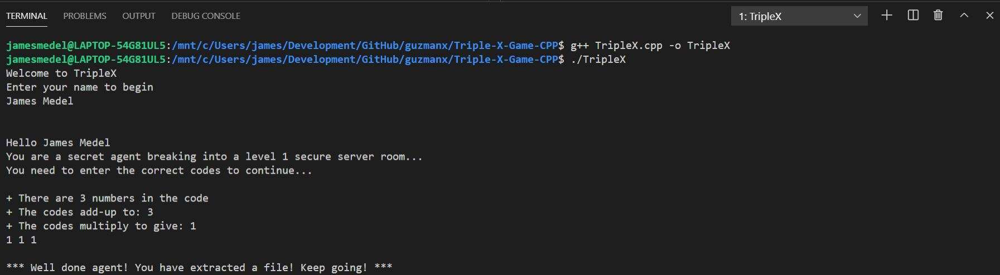

# Triple X Game C++

## Description

Number Puzzle Game, which involves hacking into a computer lock by finding a valid 3 number combination

## Story

You are a secret agent breaking into a LEVEL 2 server room.
Your SuperHacker 2000 tells you the following information

* There are 3 numbers in the code
* The codes multiply to give 18
* The codes add up to 8

As the player, we have to enter the 3 code numbers followed by x

**NOTE:** Once we successfully solve this first puzzle, then we will proceed to the next LEVEL with each LEVEL getting more difficult.

## Why Create this Game, what do we learn?

- Learn basics of C++ "syntax"
- Learn about variables and constants
- Create your own function with an argument
- Use #include that will be used inside Unreal Engine
- Learn about the `if` and `while` structures

## Why Learn C++ Programming?

- All roads lead to C++ in game development
- You'll be learning a superpower
- C++ is both a high-level and low-level
    - It covers the very high-level like object oriented programming
    - It covers the very low-level like getting into the bits and bytes
- Join a unique tribe of power users

## Demo

~~~bash
g++ TripleX.cpp -o TripleX
./TripleX
~~~

